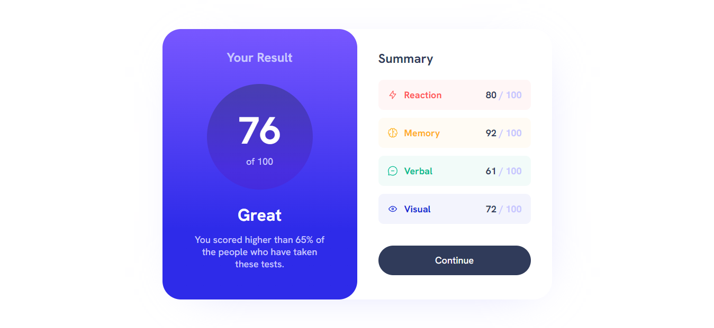

# Frontend Mentor - Results summary component solution

This is a solution to the [Results summary component challenge on Frontend Mentor](https://www.frontendmentor.io/challenges/results-summary-component-CE_K6s0maV). Frontend Mentor challenges help you improve your coding skills by building realistic projects.

## Table of contents

- [Overview](#overview)
  - [The challenge](#the-challenge)
  - [Screenshot](#screenshot)
  - [Links](#links)
- [My process](#my-process)
  - [Built with](#built-with)
  - [What I learned](#what-i-learned)
  - [Continued development](#continued-development)
  - [Useful resources](#useful-resources)
- [Author](#author)

## Overview

### The challenge

Users should be able to:

- View the optimal layout for the interface depending on their device's screen size
- See hover and focus states for all interactive elements on the page

### Screenshot



### Links

- Solution URL: [Github Repository](https://github.com/AlanJVD/Results-summary-component)
- Live Site URL: [Github Pages](https://alanjvd.github.io/Results-summary-component/)

## My process

### Built with

- HTML5
- CSS

### What I learned

I learned about how the CSS justify-content: space-between works, as well as the transparency property in HSLA colors.

```css
.box {
  border-radius: 10px;
  display: flex;
  justify-content: space-between;
  padding: 17px;
  margin: 0 0 15px;
}

.reaction {
  background: hsla(0, 100%, 67%, 0.05);
  color: hsl(0, 100%, 67%);
}
```

### Continued development

I will be studying and practicing CSS media queries in order to improve my mobile design skills. Also, I will be reading the documentation of HTML, CSS and JavaScript.

### Useful resources

- [w3schools](https://www.w3schools.com/) - This helped me to understand more about CSS justify-content and media queries. I'd recommend it to anyone still learning.
- [CSS Gradient](https://cssgradient.io/) - This is an amazing page in which you can create your own gradient background with CSS.
- [CSS matic](https://www.cssmatic.com/) - This helped me create a shadow for the results summary card.

## Author

- Frontend Mentor - [Alan Delgado](https://www.frontendmentor.io/profile/AlanJVD)
- LinkedIn - [Alan Delgado](https://www.linkedin.com/in/alan-delgado-528629256/)
